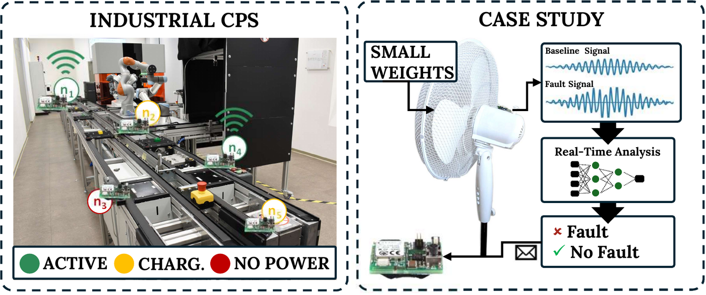
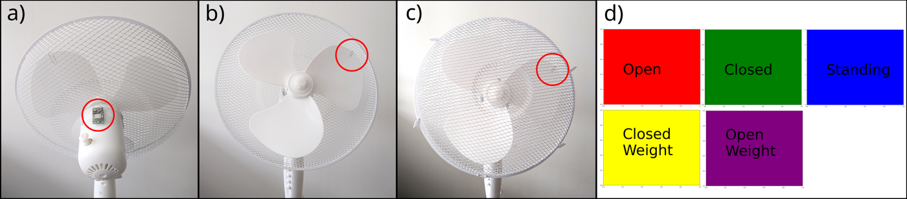

Our demo paper **“Predictive Maintenance without Maintenance”** has been accepted at **RTCSA 2026** [@kindt2026predictive]. The authors are Philipp H. Kindt, Sebastiano Gaiardelli, Marco Caccamo, Thomas Wild, Andreas Herkersdorf, and Samarjit Chakraborty.

## Monitoring without battery replacements

Predictive maintenance depends on observations of how machines behave over time. Existing machine sensors are often designed for control or safety, and their measurements may be difficult to access or unsuitable for condition monitoring. Additional wireless sensors can provide vibration, sound, and temperature measurements without changes to the machine’s internal systems.

Those sensors also need power. Batteries require replacement, which becomes costly across a large installation and can be impractical in sealed or inaccessible locations. Wiring introduces installation costs and limits where sensors can be placed.

We investigate an alternative: sensors that harvest ambient energy, analyse measurements locally, and report signs of a developing fault. The paper presents a small vibration-classification case study and discusses the work needed to turn this approach into a batteryless system.

*Batteryless nodes on a production line are intermittently available (left). The case study grounds the idea on a single retrofitted vibration sensor (right).*

## Communication and computation with intermittent power

A batteryless node may have to wait until it has stored enough energy before sensing or transmitting. When it wakes, its receiver may be asleep. Sensing, computation, and communication therefore need to be planned together.

For communication, we propose sending compact reports when measurements suggest an anomaly or when a diagnostic query requests information. Neighbour-discovery schedules, which combine short beacons with brief listening windows, offer a way for nodes to find each other without maintaining a continuously synchronised connection.

Adapting these schedules to harvested energy remains an open problem. Existing deterministic discovery guarantees assume a fixed energy budget and schedule. A harvesting node’s available energy changes with its surroundings. We need protocols that can adjust to those changes while retaining useful bounds on discovery time.

For computation, a simple local detector could screen routine observations. A possible anomaly could trigger a more accurate model, an exchange of features with neighbouring nodes, or a report to a remote system. This would let the node reserve more expensive processing and communication for observations that need further analysis.

## A vibration-classification case study

We attached a small accelerometer node to a pedestal fan and clipped a paperclip to one blade to introduce an imbalance. This provided a simple setup for examining how much data and computation were needed to distinguish operating conditions.

*(a) The sensor, taped on. (b, c) Cover open and closed, with a paperclip creating an imbalance. (d) Output of the real-time classifier.*

We sampled acceleration at about 25 Hz and recorded roughly 1600 windows of 200 samples. Using FFT coefficients from one-dimensional acceleration, we trained a multilayer perceptron with a single hidden layer of five nodes.

We evaluated it on a separate set of approximately 1000 windows: 166 with the fan stopped, 239 with it rotating and the cover closed, 177 with the cover open, 168 with the cover open and the paperclip attached, and 220 with the cover closed and the paperclip attached. **All of these evaluation windows were classified correctly.** A real-time version also identified the steady states following changes such as opening the cover.

## Reducing the computation

To explore smaller models, we downsampled the signal to 10 Hz and retrained using windows of 16 samples.

| Model | Parameters | MACs | Accuracy |
| --- | ---: | ---: | ---: |
| Decision tree | 8 | 0 | 91.8% |
| DS-CNN | 131 | 488 | 99.3% |

The decision tree uses fewer resources, while the depthwise-separable convolutional neural network (DS-CNN) achieves higher accuracy with 488 multiply-accumulate operations (MACs). This suggests a possible two-stage design: use the tree for initial screening and invoke the CNN when more information is needed and enough energy is available. Further analysis could then use a higher sampling rate or a longer observation window.

This sequence is a proposed design, rather than a complete system demonstrated in the experiments.

## What the demonstration establishes

The experiments show that small models and low sampling rates can distinguish the tested fan conditions. **The sensor was battery-powered, and inference ran on a laptop.** We have not yet demonstrated the full sensing and inference pipeline on a node powered by harvested energy.

The next step is to run these models on the device, account for power interruptions, and integrate communication between intermittently available nodes. The case study helps establish the computational requirements for that work; broader evaluation is needed before drawing conclusions about industrial fault detection.

---

*Figures are taken from the accepted version of the paper and are © IEEE. The definitive version will appear in the RTCSA 2026 proceedings on IEEE Xplore; we cannot host the PDF here.*
